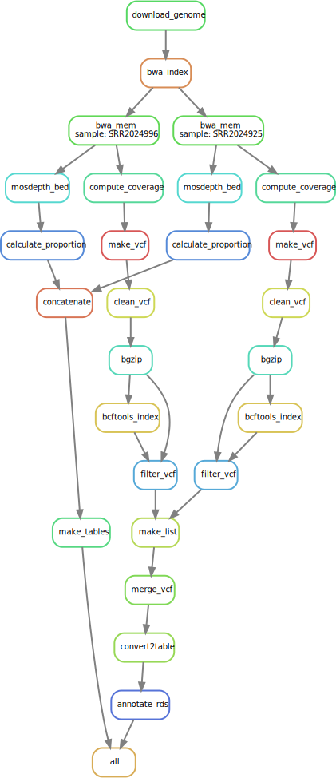

# pipeline for MTBC putative regions of difference discovery

[](https://doi.org/10.1128/mSphere.00535-21)
[](https://snakemake.github.io)
[](https://github.com/dbespiatykh/RDscan/actions/workflows/main.yml)

- [pipeline for MTBC putative regions of difference discovery](#pipeline-for-mtbc-putative-regions-of-difference-discovery)
  - [Description](#description)
  - [Installation](#installation)
  - [Usage](#usage)
  - [Output](#output)
  - [Citation](#citation)
  - [License](#license)

## Description

RDscan is a [snakemake](https://snakemake.readthedocs.io/en/stable/) workflow to find deletions and putative [regions of difference](https://jb.asm.org/content/178/5/1274.short) (RDs) in [mycobacterium tuberculosis complex](https://en.wikipedia.org/wiki/Mycobacterium_tuberculosis_complex) (MTBC) genomes, it is also capable to determine already known or user defined RDs.

## Installation

The usage of this workflow is described in the [Snakemake Workflow Catalog](https://snakemake.github.io/snakemake-workflow-catalog/?usage=dbespiatykh/RDscan), alternatively it can be installed as described below.

Use the [Conda](https://docs.conda.io/en/latest/) package manager and [BioConda](https://bioconda.github.io/index.html) channel to install RDscan.

If you do not have conda installed do the following:

```bash
# Download Conda installer
wget https://repo.anaconda.com/miniconda/Miniconda3-latest-Linux-x86_64.sh
# Set permissions
chmod -X Miniconda3-latest-Linux-x86_64.sh
# Install
bash Miniconda3-latest-Linux-x86_64.sh
```

Set up channels:

```bash
conda config --add channels defaults
conda config --add channels bioconda
conda config --add channels conda-forge
```

Get **RDscan** snakemake workflow:

```bash
git clone https://github.com/dbespiatykh/RDscan.git
```

Install all required dependencies:

```bash
cd RDscan
conda install -c conda-forge mamba
mamba env create --file environment.yml
```

## Usage

<details>
  <summary>Rulegraph of the pipeline</summary>
  

  
</details>

<br>

Activate **RDscan** environment:

```bash
conda activate RDscan
```

Run pipeline:

```bash
snakemake --conda-frontend mamba --use-conda -j {Number of cores}
```

It is recommended to use dry run if you are running pipeline for the first time, to see if everything is in working order, for this you can use `-n` flag:

```bash
snakemake -n
```

## Output

Output in the `results` directory will contain four tables: `RD_putative.tsv`, `RD_known.tsv`, `RD_known.xlsx`, and `RD_known.bin.tsv`

Example of the `RD_putative.tsv`:
Table containing all discovered putative RDs.

**RD** - Known RDs that intersects with deletion breakpoints;
**SIZE** - Estimated size of predicted deletion.

Values in cells represent deletion length in the sample.

| CHROM     | START  | END    | SIZE | RD  | TYPE | ERR015582 | ERR017778 | ERR017782 | ERR019852 |
| --------- | ------ | ------ | ---- | --- | ---- | --------- | --------- | --------- | --------- |
| NC_000962 | 333828 | 338580 | 5800 |     | DEL  | 7113      | 7084      | 7050      |
| NC_000962 | 340400 | 340645 | 245  |     | DEL  |           |           |           |           |
| NC_000962 | 350935 | 351175 | 238  |     | DEL  |           | 300       | 204       | 240       |
| NC_000962 | 361769 | 362988 | 1391 |     | DEL  | 1833      | 1392      | 1833      | 1390      |

Example of the `RD_known.tsv`:

Table containing proportion of coverage in particular RDs.

| Sample    | N-RD25_tbA | N-RD25_tbB | N-RD25bov/cap | N-RD25das |
| --------- | ---------- | ---------- | ------------- | --------- |
| ERR015582 | 0.883562   | 0.856164   | 0.856164      | 0.808219  |
| ERR017778 | 0          | 0          | 0             | 0.41791   |
| ERR017782 | 1.021277   | 1.042553   | 1.106383      | 0.978723  |
| ERR019852 | 0          | 0          | 0             | 0.386364  |

Example of the `RD_known.xlsx`:

Same as the `RD_known.tsv`, but in a [XLSX](https://en.wikipedia.org/wiki/Microsoft_Excel) format with applied contiditional formatting.\
Conditional formatting corresponds with threshold value in a `config.yml` file.


Binary version of the `RD_known.bin.tsv`:

| Sample    | N-RD25_tbA | N-RD25_tbB | N-RD25bov/cap | N-RD25das |
| --------- | ---------- | ---------- | ------------- | --------- |
| ERR015582 | 0          | 0          | 0             | 0         |
| ERR017778 | 1          | 1          | 1             | 0         |
| ERR017782 | 0          | 0          | 0             | 0         |
| ERR019852 | 1          | 1          | 1             | 0         |

## Citation

If you use `RDscan` for your research, please cite the pipeline:

> D. Bespiatykh, J. Bespyatykh, I. Mokrousov, and E. Shitikov, A Comprehensive Map of Mycobacterium tuberculosis Complex Regions of Difference, mSphere, Volume 6, Issue 4, 21 July 2021, Page e00535-21, https://doi.org/10.1128/mSphere.00535-21

All references for the tools utilized by the `RDscan` can be found in the [`CITATIONS.md`](CITATIONS.md) file.

## License

[MIT](LICENSE)
